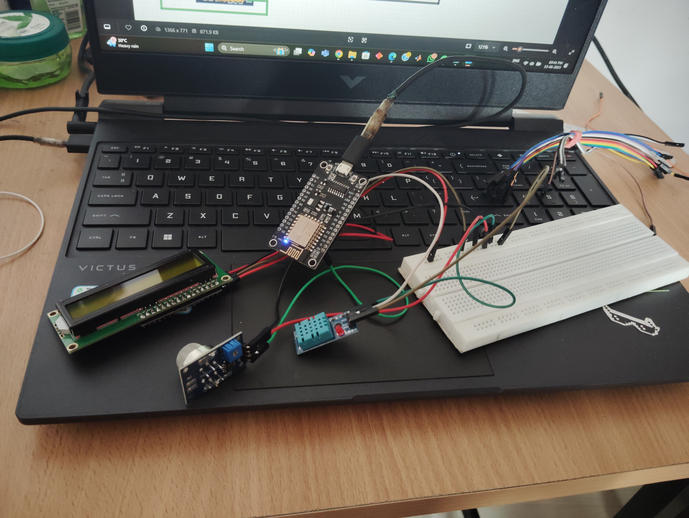

# Monitor-air-quality
Developed an air quality monitoring system using Arduino IDE with the following components: NodeMCU ESP8266, MQ135 Sensor, DHT11 Sensor, LCD Display, and I2C Converter

# 🌫️ Air Quality Monitoring System

A real-time air quality monitoring system using NodeMCU ESP8266, MQ135, DHT11, and LCD with I2C. Built with Arduino IDE, the system monitors temperature, humidity, and air pollution levels and displays data on an LCD.

---

## 📦 Components Used

- NodeMCU ESP8266  
- MQ135 Gas Sensor  
- DHT11 Temperature & Humidity Sensor  
- 16x2 LCD Display  
- I2C Converter for LCD  
- Jumper Wires / Connecting Cables  

---

## ⚙️ Features

- Real-time air quality, temperature, and humidity monitoring  
- LCD display via I2C interface  
- Developed using Arduino IDE  
- Wi-Fi enabled microcontroller (ESP8266) for future IoT expansion  

---

## 🖥️ How It Works

1. MQ135 measures air quality (e.g., CO2, NH3).  
2. DHT11 provides temperature and humidity readings.  
3. NodeMCU processes sensor data and displays it on the LCD.  
4. Optional: ESP8266 Wi-Fi can be used to send data to the cloud.

---

## 🛠️ Setup & Instructions

1. Connect components as per your circuit.  
2. Open `air_quality_monitor.ino` in Arduino IDE.  
3. Install required libraries:
    - `Adafruit Unified Sensor`
    - `DHT sensor library`
    - `LiquidCrystal_I2C`
4. Select **NodeMCU 1.0 (ESP-12E Module)** and correct COM port.  
5. Upload code and power the system.  

---

## 📷 Images 
 
> 
> > 

---

## 📄 License

This project is licensed under the [MIT License](LICENSE).

---

## 🙌 Acknowledgments

- Arduino Community  
- Adafruit Libraries  
- Tech blogs and tutorials that inspired this build

